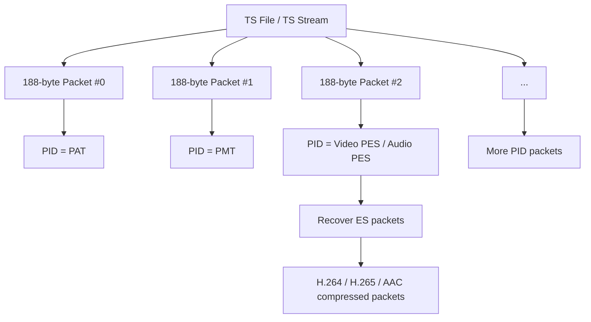
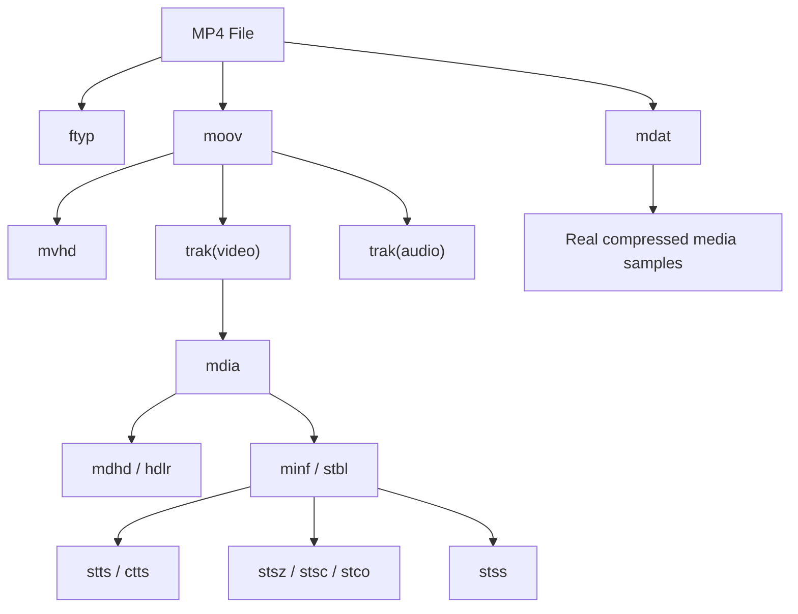
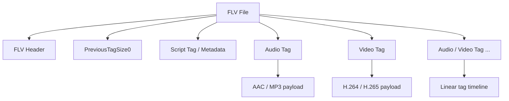

# TS / MP4 / FLV 封装格式对比报告

## 1. 目的

这份报告用于从 FFmpeg 学习与工程调试视角，对比 `TS`、`MP4`、`FLV` 三种常见封装格式的特点、异同，以及在 `avformat_open_input`、`avformat_find_stream_info`、`AVFormatContext`、`AVStream`、`AVPacket` 探测中常见的表现差异。

重点回答几个实际问题：

- 为什么有的文件 `container duration` 有值，但 `stream duration` 没有值
- 为什么 `MP4` 往往更容易拿到完整轨道信息
- 为什么 `TS` / `FLV` 更常见于直播链路
- 为什么不同封装在 seek、时长、首包、索引能力上差异明显

---

## 2. 三种格式一句话概括

### 2.1 TS

`TS` 更偏“传输流”，强调抗干扰、连续播发、边下边播，典型用于直播、广播、HLS 分片。

### 2.2 MP4

`MP4` 更偏“文件型封装”，强调结构化索引、轨道组织、随机访问和播放器兼容性，典型用于点播、本地文件、短视频分发。

### 2.3 FLV

`FLV` 是一种历史上非常适合流式传输的封装，结构线性、实现直接，曾长期用于 RTMP 推流与播放，也常用于直播中间格式。

---

## 3. 核心定位差异

### 3.1 TS 的定位

- 面向传输
- 允许边写边播
- 容忍丢包和弱网环境
- 不依赖完整文件尾部结构
- 典型搭配：`UDP`、`RTP over MPEG-TS`、`HLS ts segment`

### 3.2 MP4 的定位

- 面向文件播放与分发
- 轨道、样本、时间表组织完整
- 强依赖索引和元数据结构
- 更适合点播、下载后播放、精确 seek
- 典型搭配：本地 `mp4` 文件、点播平台、短视频素材

### 3.3 FLV 的定位

- 面向线性流式封装
- 音视频 tag 顺序写入
- 结构相对简单
- 常用于 RTMP 上层数据承载
- 典型搭配：`RTMP 推流`、`live_flv`

---

## 4. 封装结构上的根本区别

### 4.1 TS 结构特点

TS 的基本单位是固定长度包，通常是 `188 bytes`。

特点：

- 数据被切成很多固定小包
- 每个包带 `PID`
- 音视频、PAT、PMT 等都混在一个连续流里
- 强调“持续发送”，而不是“完整文件描述”

这意味着：

- 非常适合网络传输
- 结构不依赖文件尾
- 但文件级索引能力弱

### 4.2 MP4 结构特点

MP4 的结构是 box / atom 组织。

典型 box：

- `ftyp`
- `moov`
- `mdat`
- `trak`
- `mdhd`
- `stts`
- `stsz`
- `stss`

特点：

- 每路音视频轨道独立组织
- 时间表、样本大小、关键帧表更规范
- 非常利于 seek、时长统计、帧定位

这意味着：

- 对点播最友好
- 对分析最友好
- 但如果 `moov` 不合适，边播性不如 TS / FLV 自然

### 4.3 FLV 结构特点

FLV 更像线性 tag 流：

- 文件头
- metadata tag
- audio tag
- video tag
- script tag

特点：

- 写入顺序天然就是播放顺序
- 非常适合实时产生、实时发送
- 容器整体结构简单
- 轨道级索引能力比 MP4 弱

---

## 5. duration 为何表现不同

这是工程调试里最重要的一块。

### 5.1 先分清两个 duration

在 FFmpeg 里常看到两个层次：

- `AVFormatContext.duration`
  代表容器级总时长
- `AVStream.duration`
  代表某一路流自己的时长

它们不是同一个东西，也不是一定同时存在。

### 5.2 MP4 为什么更容易有 stream duration

MP4 里通常有比较完整的轨道时间表和样本表，所以 FFmpeg 更容易计算：

- 每个 track 从哪里开始
- 一共有多少 sample
- 每个 sample 时间长度是多少
- 整路流总时长是多少

所以在 MP4 中更常看到：

- `container duration` 有
- `video stream duration` 有
- `audio stream duration` 也常有

### 5.3 FLV 为什么常见 container duration 有，但 stream duration 没有

FLV 更偏线性写入。

FFmpeg 往往能通过：

- metadata
- 文件尾时间戳
- 解封装统计

估出整个文件时长，于是：

- `AVFormatContext.duration` 可能有值

但是每一路流并不一定有独立、完整、可直接计算的总时长表，所以常见：

- `AVStream.duration = AV_NOPTS_VALUE`
- 页面显示为 `duration: unknown`

这正是你在 `believe.flv` 里看到的现象。

### 5.4 TS 为什么也经常拿不到稳定时长

TS 更偏传输，不偏文件。

常见情况：

- 文件是直播录下来的
- 时间戳有跳变
- 没有完整尾部
- PAT / PMT 和 PTS 关系更适合持续播放，不适合文件级精确统计

所以 TS 中也经常出现：

- 总时长需要估算
- 某一路流 duration 缺失
- `nb_frames = 0`
- seek 不够精确

### 5.5 实际经验总结

时长字段完整性通常大致是：

`MP4 > FLV > TS`

但在“能否边写边播”上，通常相反更接近：

`TS / FLV > MP4`

---

## 6. 时间戳与 time_base 特点

### 6.1 TS

- 时间戳常和 `90kHz` 系统时钟体系关系紧密
- 常见 `time_base` 可能是 `1/90000`
- 网络传输里常出现非从 0 开始的时间线

### 6.2 MP4

- 每个 track 可能有自己的 timescale
- 常见 `time_base` 不同于视频帧率本身
- 更适合做精确的 sample 时间管理

### 6.3 FLV

- 常见以毫秒为主的时间表达
- 在 FFmpeg 探测里经常看到 `time_base: 1/1000`
- 对实时写入和实时封装比较直接

---

## 7. 索引与 seek 能力对比

### 7.1 MP4

最强。

原因：

- 有清晰的 sample table
- 常有关键帧索引
- 可以精确跳转

适合：

- 点播
- 本地拖动进度条
- 剪辑素材分析

### 7.2 FLV

中等。

原因：

- 是线性 tag 结构
- 依赖 metadata 和解析过程
- seek 能做，但精度和稳定性一般不如 MP4

### 7.3 TS

通常最弱。

原因：

- 更偏传输流
- 缺乏像 MP4 那样天然的轨道索引结构
- seek 常依赖额外扫描

---

## 8. 直播 / 点播适配性

### 8.1 TS

更适合直播链路。

优点：

- 边产生边发送
- 容错更好
- HLS 传统分片格式就是 TS

缺点：

- 文件分析体验差
- seek 和 duration 统计不如 MP4

### 8.2 MP4

更适合点播与文件交付。

优点：

- 轨道信息完整
- 播放器支持广
- 分析与探测结果最好

缺点：

- 传统 MP4 不天然适合实时写一边播
- 如果做直播，常需转成 `fMP4` 这种更流式友好的形态

### 8.3 FLV

更适合直播中间层。

优点：

- 线性写入很自然
- RTMP 上最经典
- 直播封装和调试相对直观

缺点：

- 文件级结构能力不如 MP4
- 现代点播生态不如 MP4 主流

---

## 9. HLS / RTMP / RTP 中常见搭配

### 9.1 HLS

常见两类分片：

- `TS`
- `fMP4`

说明：

- 传统 HLS 经常是 `ts`
- 新一些的低延迟或现代方案更常见 `fMP4`

### 9.2 RTMP

上层通常承载：

- `FLV`

说明：

- RTMP 推流时，数据往往会被组织成 FLV tag 风格再发

### 9.3 RTP

RTP 自己不是文件封装格式，而是传输协议。

它常传的是：

- H264 NAL
- AAC LATM
- MPEG-TS over RTP

所以 RTP 的研究重点通常不在“像 MP4/FLV 那样的文件封装”，而在：

- payload format
- sequence number
- timestamp
- jitter / loss / reorder

---

## 10. 用 FFmpeg 探测时的常见现象

### 10.0 从 FFmpeg 解封装视角先看三者

在 FFmpeg 里，这三类文件的“解封装”主线都是一样的：

1. `avformat_open_input`
2. `avformat_find_stream_info`
3. 读取 `AVFormatContext / AVStream / AVCodecParameters`
4. `av_read_frame` 连续取出压缩包 `AVPacket`

也就是说，三者在 API 入口上没有本质区别，差异主要体现在：

- demuxer 内部如何识别并解析容器
- 能补出多少 stream 级信息
- `duration / nb_frames / bit_rate / start_time` 的完整度如何
- packet 时间戳是否稳定、是否从 0 开始

下面分格式看。

### 10.0.1 FFmpeg 解封装 MP4 时

FFmpeg 打开 MP4 时，通常会从 box / atom 结构中读取：

- `ftyp`
- `moov`
- `trak`
- `mdhd`
- `stts`
- `stsz`
- `stss`
- `ctts`
- `stsc`
- `stco/co64`

这意味着 demuxer 很容易在还没大量读包之前，就先补齐：

- 每路流的 codec 参数
- track 时长
- sample 时间表
- 帧率估计
- 关键帧表

所以在 `Movie Prober` 中探测 MP4 时，常见表现是：

- `AVFormatContext.duration` 有值
- `AVStream.duration` 也常有值
- `stream->nb_frames` 更容易有值
- `codec_tag` 往往比较明确
- `av_read_frame` 读出来的首包顺序更符合文件 sample 排布

### 10.0.2 FFmpeg 解封装 FLV 时

FFmpeg 打开 FLV 时，主要是按线性 tag 流去解析：

- FLV header
- script / metadata tag
- audio tag
- video tag

demuxer 更像是在“顺着流往下读”，而不是像 MP4 那样先拿到一整套完整轨道表。

所以常见表现是：

- `AVFormatContext.duration` 可能有值
- `AVStream.duration` 常常没有值
- `stream->nb_frames` 常见为 `0`
- `time_base` 常见是 `1/1000`
- `av_read_frame` 读出来的音视频交织顺序很直观

这也正是你在当前工程里分析 `believe.flv` 时看到的现象：

- 容器时长有
- 视频流时长 `unknown`
- 音频流时长 `unknown`

### 10.0.3 FFmpeg 解封装 TS 时

FFmpeg 打开 TS 时，主要处理的是：

- 固定长度 transport packet
- `PAT / PMT`
- 各路 PID
- PES
- PTS / DTS

TS 的 demux 更偏“从传输流里恢复出各路 elementary stream”，不是从一个天然文件索引结构里查表。

因此常见表现是：

- `AVFormatContext.duration` 可能没有，或者需要估算
- `AVStream.duration` 更容易缺失
- `start_time` 可能不是 0
- `nb_frames` 常常不可靠
- packet 时间戳通常比 stream 总时长更值得信任

如果 TS 文件来自直播录制，这种现象会更明显。

### 10.1 探测 MP4 常见结果

- `format_name: mov,mp4,m4a,3gp,3g2,mj2`
- `duration` 稳定
- `stream duration` 常有
- `frames` 更容易有值
- `codec_tag` 更有意义

### 10.2 探测 FLV 常见结果

- `format_name: flv`
- `container duration` 可能有
- `stream duration` 常见 `unknown`
- `time_base` 常见 `1/1000`
- `nb_frames` 可能是 `0`

### 10.3 探测 TS 常见结果

- `format_name: mpegts`
- duration 可能不稳定或需要估算
- 某些流的 `start_time` 不是 0
- `stream duration` 更容易缺失
- 包级时间戳通常比流级总时长更可靠

---

## 11. 三者异同总结表

| 维度 | TS | MP4 | FLV |
|---|---|---|---|
| 主要定位 | 传输流 | 文件封装 | 流式封装 |
| 更适合直播 | 强 | 一般 | 强 |
| 更适合点播文件 | 一般 | 强 | 一般 |
| 结构组织 | 固定小包 + PID | box / atom | tag 线性流 |
| 轨道信息完整度 | 较弱 | 强 | 中等 |
| stream duration 完整度 | 较弱 | 强 | 中等偏弱 |
| seek 能力 | 弱 | 强 | 中 |
| 首包友好性 | 强 | 一般 | 强 |
| HLS 常见性 | 很强 | 现代 HLS 常见 fMP4 | 不常见 |
| RTMP 常见性 | 不典型 | 不典型 | 很强 |

---

## 11.5 文件结构图版

下面用简化结构图直观看三种封装。

### 11.5.1 TS 简化结构图

怎么理解：

- 整体是很多固定大小的小包拼起来
- 每个包靠 `PID` 表示它属于哪一路表或哪一路音视频
- demux 时先识别 `PAT / PMT`
- 再找到视频 PID、音频 PID
- 再从 `PES` 里恢复压缩包

这就是为什么 TS 更像“传输流恢复”，而不是“文件查表”。

### 11.5.2 MP4 简化结构图

怎么理解：

- `moov` 里放的是结构化索引和轨道信息
- `mdat` 里放的是真正媒体数据
- 视频、音频 track 各自有自己的 sample table
- demux 时很像：
  - 先读目录
  - 再根据表去定位样本

这就是为什么 MP4 在：

- `duration`
- `stream duration`
- `nb_frames`
- `seek`

这些方面通常表现最好。

### 11.5.3 FLV 简化结构图

怎么理解：

- FLV 更像一条线性 tag 流
- metadata、音频 tag、视频 tag 依次排下去
- 没有 MP4 那种很强的轨道样本表体系
- demux 时更像“顺着 tag 往下读”

这就是为什么 FLV：

- 边写边播很自然
- 直播友好
- 但轨道时长、帧数、索引能力通常不如 MP4

### 11.5.4 三者结构直觉对比

可以把三者记成三个关键词：

- `TS`
  很多小包，按 PID 分路，先恢复节目再恢复音视频
- `MP4`
  先看目录和索引表，再定位音视频样本
- `FLV`
  一串 tag 顺着写，谁先来就先读谁

---

## 12.5 从 FFmpeg demux 行为再总结一遍

如果只从“FFmpeg 解封装拿信息的难易程度”来排，大致可以理解为：

`MP4 demux 最像查表`

- 打开后就能从 box / sample table 拿到很多结构化信息

`FLV demux 更像顺流读 tag`

- 先有容器线性流，再逐步恢复音视频包

`TS demux 更像恢复传输流中的节目与 elementary stream`

- 先识别节目和 PID，再从 PES 中恢复压缩包

因此在工程调试中，你看到的信息完整度通常会呈现：

- `MP4`：最完整
- `FLV`：中间
- `TS`：最依赖实时读包和估算

---

## 12. 针对当前工程的理解建议

### 12.1 在 `Movie Prober` 页面里

看 `duration` 时，先分三层：

- 容器总时长
- stream 时长
- packet 时间戳

不要把它们混成一个概念。

### 12.2 调试直播录制输出时

如果是 `FLV`：

- 先接受 `stream duration` 可能缺失
- 更关注 `packet pts/dts`
- 更关注首包是否正常、音视频是否交织正常

### 12.3 分析点播素材时

如果是 `MP4`：

- 更适合验证完整 duration
- 更适合看 `frames`
- 更适合做 seek / probe / 轨道核对

### 12.4 研究流媒体专题时

如果是 `HLS`：

- `TS` 分片更偏传统直播思路
- `fMP4` 分片更偏现代流媒体思路
- 不要拿分片级现象和完整文件 MP4 现象完全等同

---

## 13. 最终结论

如果从“文件分析友好度”看：

`MP4` 最强，`FLV` 次之，`TS` 最弱。

如果从“实时传输与边写边播友好度”看：

`TS` 和 `FLV` 更强，传统 `MP4` 较弱。

如果从你当前工程的 FFmpeg 学习价值看：

- 学时长、轨道、sample table：优先看 `MP4`
- 学直播封装、RTMP、线性写入：优先看 `FLV`
- 学 HLS 分片、直播传输、弱索引流：优先看 `TS`

这三种格式不是简单谁好谁坏，而是各自服务于不同场景。
