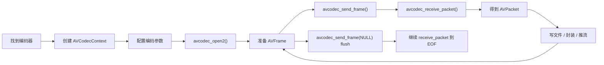

# FFmpeg 编码器使用方式与 MediaCodec 对比报告

## 1. 报告目的

这份报告用于整理两部分内容：

- FFmpeg 编码器的通用使用方式
- FFmpeg 编码器与 Android `MediaCodec` 编码流程的异同点

目标不是一次性穷尽所有 API，而是先建立一套稳定的“主流程理解框架”，便于后续继续阅读：

- `AacEncodeActivity`
- `VideoEncodeActivity`
- `AVEngine.cpp`

---

## 2. FFmpeg 编码器的通用使用方式

先记最核心的一句话：

**FFmpeg 编码器通用流程 = 配置编码器 -> 准备输入帧 -> 送帧 -> 取包 -> flush 收尾**

可以先用总流程图理解：



### 2.1 找到编码器

第一步是找到目标编码器，例如：

```cpp
const AVCodec* codec = avcodec_find_encoder(AV_CODEC_ID_AAC);
```

或：

```cpp
const AVCodec* codec = avcodec_find_encoder(AV_CODEC_ID_H264);
```

作用：

- 告诉 FFmpeg：我要一个支持这种编码格式的编码器实现

### 2.2 创建编码器上下文

找到编码器后，需要创建编码器实例：

```cpp
AVCodecContext* codecContext = avcodec_alloc_context3(codec);
```

`AVCodecContext` 可以理解成：

- 当前这次编码任务的“编码器实例”
- 参数承载体
- 输入输出交互中心
- 编码器内部状态机

### 2.3 配置编码参数

这一步是告诉编码器“我要怎么压”。

#### 音频常见参数

- `sample_rate`
- `ch_layout`
- `sample_fmt`
- `bit_rate`
- `time_base`

#### 视频常见参数

- `width`
- `height`
- `pix_fmt`
- `bit_rate`
- `framerate`
- `time_base`
- `gop_size`
- `profile`
- `level`

例如音频编码常见写法：

```cpp
codecContext->bit_rate = 64000;
codecContext->sample_rate = 44100;
codecContext->sample_fmt = AV_SAMPLE_FMT_FLTP;
codecContext->time_base = AVRational{1, 44100};
```

例如视频编码常见写法：

```cpp
codecContext->width = 1280;
codecContext->height = 720;
codecContext->pix_fmt = AV_PIX_FMT_YUV420P;
codecContext->bit_rate = 2000000;
codecContext->time_base = AVRational{1, 30};
codecContext->framerate = AVRational{30, 1};
```

### 2.4 打开编码器

参数准备好后，正式启动编码器：

```cpp
avcodec_open2(codecContext, codec, nullptr);
```

只有这一步成功后，编码器才算 ready，可以开始接受 `AVFrame`。

### 2.5 准备输入帧 `AVFrame`

FFmpeg 编码器不直接吃“随便一块 byte 数组”，而是统一吃 `AVFrame`。

`AVFrame` 可以理解成：

- 一帧视频
- 或一帧音频
- 再附带格式信息和时间戳

#### 音频 `AVFrame` 常见字段

- `nb_samples`
- `format`
- `sample_rate`
- `ch_layout`
- `pts`

#### 视频 `AVFrame` 常见字段

- `width`
- `height`
- `format`
- `data[]`
- `linesize[]`
- `pts`

### 2.6 把 `AVFrame` 送进编码器

通用调用：

```cpp
avcodec_send_frame(codecContext, frame);
```

作用：

- 把当前这帧原始数据交给编码器处理

注意：

- `send_frame()` 不等于“立刻有输出”
- 编码器内部可能存在缓存、延迟、重排序

### 2.7 从编码器取出 `AVPacket`

通用调用：

```cpp
avcodec_receive_packet(codecContext, packet);
```

作用：

- 尝试从编码器取出已经压缩好的输出包

`AVPacket` 可以理解成：

- 一包 AAC 数据
- 一帧或一包 H.264/H.265 压缩码流
- 能继续写文件、封装或推流的压缩产物

常见返回结果：

- 成功：取到一个 `AVPacket`
- `EAGAIN`：当前还没新包，需要继续送输入
- `EOF`：编码器输出已经彻底结束

### 2.8 为什么是 send / receive 分离模型

因为编码器内部不是严格“一进一出同步”。

内部可能存在：

- 缓冲
- 延迟
- B 帧重排序
- 码率控制
- 帧合并 / 拆分

所以标准使用方式总是：

```cpp
avcodec_send_frame(...)
while (avcodec_receive_packet(...) == 0) {
    ...
}
```

### 2.9 处理输出 `AVPacket`

取出 `AVPacket` 后，下一步取决于业务目标：

#### 如果写裸流

- 直接写字节到文件
- 例如 `.h264`、`.h265`

#### 如果做封装

- 交给 muxer
- 例如 `av_interleaved_write_frame()`

#### 如果做推流

- 交给 FLV / RTMP / TS 等输出上下文

### 2.10 flush 收尾

当没有更多输入帧时，不能直接关编码器。

而是要：

```cpp
avcodec_send_frame(codecContext, nullptr);
```

作用：

- 告诉编码器：后面没有新输入了
- 请把内部剩余结果全部吐出来

之后还要继续：

```cpp
avcodec_receive_packet(...)
```

直到返回 `AVERROR_EOF`。

这一步非常关键，能避免尾包丢失。

### 2.11 FFmpeg 编码器通用伪代码

```cpp
codec = avcodec_find_encoder(...)
codecContext = avcodec_alloc_context3(codec)

配置 codecContext 各种参数

avcodec_open2(codecContext, codec, nullptr)

while (还有输入数据) {
    frame = 准备好一个 AVFrame
    frame->pts = ...

    avcodec_send_frame(codecContext, frame)

    while (true) {
        result = avcodec_receive_packet(codecContext, packet)
        if (result == EAGAIN || result == EOF) {
            break
        }
        处理 packet
    }
}

avcodec_send_frame(codecContext, nullptr)

while (true) {
    result = avcodec_receive_packet(codecContext, packet)
    if (result == EOF || result == EAGAIN) {
        break
    }
    处理 packet
}
```

---

## 3. FFmpeg 与 MediaCodec 的总体关系

先记最核心的结论：

**FFmpeg 和 MediaCodec 的编码主线本质相同，都是“配置 -> 输入 -> 输出 -> flush -> 释放”；差别主要在接口层级和细节暴露程度。**

- `MediaCodec`：Android 平台封装得更高，很多底层细节被系统隐藏
- `FFmpeg`：接口更底层，很多隐藏步骤需要开发者自己接管

---

## 4. FFmpeg 与 MediaCodec 流程对照

### 4.1 创建编码器

#### MediaCodec

```kotlin
MediaCodec.createEncoderByType(...)
```

或：

```kotlin
MediaCodec.createByCodecName(...)
```

#### FFmpeg

```cpp
avcodec_find_encoder(...)
avcodec_alloc_context3(codec)
```

#### 对比

- `MediaCodec`：一步拿到编码器实例
- `FFmpeg`：先找 codec，再创建 context

### 4.2 配置编码参数

#### MediaCodec

通常通过 `MediaFormat`：

```kotlin
val format = MediaFormat.createAudioFormat(...)
format.setInteger(MediaFormat.KEY_BIT_RATE, ...)
format.setInteger(MediaFormat.KEY_AAC_PROFILE, ...)
codec.configure(format, null, null, MediaCodec.CONFIGURE_FLAG_ENCODE)
```

#### FFmpeg

通常直接写 `AVCodecContext`：

```cpp
codecContext->bit_rate = ...;
codecContext->sample_rate = ...;
codecContext->sample_fmt = ...;
codecContext->time_base = ...;
```

然后：

```cpp
avcodec_open2(codecContext, codec, nullptr);
```

#### 对比

- `MediaCodec`：参数通过 `MediaFormat` 传入
- `FFmpeg`：参数直接写入 `AVCodecContext`

### 4.3 输入原始数据

#### MediaCodec

有两种典型输入方式：

1. `ByteBuffer` 输入
   - 常见于音频 AAC
   - `dequeueInputBuffer()` -> 写数据 -> `queueInputBuffer()`

2. `Surface` 输入
   - 常见于视频硬编码
   - Camera2 / OpenGL 直接向 Surface 提供图像

#### FFmpeg

统一抽象成：

- 准备一个 `AVFrame`
- 把原始音视频数据填进去
- `avcodec_send_frame()`

#### 对比

- `MediaCodec`：输入接口更平台化，贴近 Android 系统缓冲区模型
- `FFmpeg`：输入统一抽象成 `AVFrame`

### 4.4 输出压缩数据

#### MediaCodec

```kotlin
val index = codec.dequeueOutputBuffer(bufferInfo, timeoutUs)
val outputBuffer = codec.getOutputBuffer(index)
```

#### FFmpeg

```cpp
avcodec_receive_packet(codecContext, packet);
```

#### 对比

- `MediaCodec`
  - 先拿输出槽位 index
  - 再拿 `ByteBuffer`
  - 再结合 `BufferInfo` 解读

- `FFmpeg`
  - 直接拿到 `AVPacket`

所以：

- `MediaCodec` 更像“缓冲区队列模型”
- `FFmpeg` 更像“帧/包模型”

### 4.5 时间戳处理

#### MediaCodec

- 输入时可能要自己提供 `presentationTimeUs`
- 输出时从 `BufferInfo.presentationTimeUs` 取

#### FFmpeg

- 输入时通常自己给 `AVFrame.pts`
- 输出时从 `AVPacket.pts/dts` 取
- 写容器前常常还要 `av_packet_rescale_ts(...)`

#### 对比

本质相同：

- 两边都需要维护输入时间线
- 两边都在输出包上携带时间信息

差异只是：

- `MediaCodec` 用 `BufferInfo`
- `FFmpeg` 用 `AVFrame / AVPacket / time_base`

### 4.6 codec config / extradata

#### MediaCodec

通常通过：

- `INFO_OUTPUT_FORMAT_CHANGED`
- `outputFormat.getByteBuffer("csd-0")`
- `outputFormat.getByteBuffer("csd-1")`

拿到：

- H.264 SPS/PPS
- AAC AudioSpecificConfig

#### FFmpeg

通常通过：

- `AVCodecContext`
- `AVStream.codecpar`
- `extradata`

由编码器和 muxer 参数体系统一管理。

#### 对比

- `MediaCodec`：codec config 需要自己从 `outputFormat` 中提取
- `FFmpeg`：stream / codec 参数体系对封装更友好

### 4.7 flush / EOS

#### MediaCodec

音频 `ByteBuffer` 输入常见：

```kotlin
queueInputBuffer(..., BUFFER_FLAG_END_OF_STREAM)
```

视频 `Surface` 输入常见：

```kotlin
signalEndOfInputStream()
```

之后继续 `dequeueOutputBuffer()`，直到输出 EOS。

#### FFmpeg

```cpp
avcodec_send_frame(codecContext, nullptr);
```

之后继续：

```cpp
avcodec_receive_packet(...)
```

直到 `AVERROR_EOF`。

#### 对比

两者本质完全一致：

- 都要明确告诉编码器“没有更多输入了”
- 都要继续 drain 输出
- 都不能一停就直接释放

### 4.8 资源释放

#### MediaCodec

通常是：

```kotlin
stop()
release()
```

#### FFmpeg

通常要释放一整串对象：

- `AVCodecContext`
- `AVFrame`
- `AVPacket`
- `SwrContext`
- `SwsContext`
- `AVAudioFifo`
- `AVFormatContext`
- `AVIOContext`

#### 对比

- `MediaCodec`：生命周期管理相对简单
- `FFmpeg`：对象更多、资源释放更细碎

---

## 5. 为什么 FFmpeg 看起来比 MediaCodec 难很多

原因不是流程真的完全不同，而是：

**MediaCodec 替你藏掉了很多中间层，FFmpeg 则把这些中间层全部暴露出来。**

MediaCodec 经常帮你隐藏的内容包括：

- 音频格式转换
- 图像像素格式转换
- 输入帧组织
- 输出包抽象
- 一部分时间线细节
- 某些 codec config 管理

而 FFmpeg 往往需要开发者自己管理：

- `AVFrame`
- `AVPacket`
- `AVCodecContext`
- `SwrContext`
- `SwsContext`
- `AVAudioFifo`
- `time_base`
- `pts/dts`
- `extradata`

所以学习感受上会明显更“重”。

---

## 6. 当前工程中的典型对应关系

### 6.1 `AacEncodeActivity` 硬编码

主线：

- `AudioRecord.read()`
- `MediaCodec.dequeueInputBuffer()`
- `queueInputBuffer()`
- `dequeueOutputBuffer()`
- 取 `ByteBuffer`
- Java 层手写 ADTS 头
- 输出 `.aac`

### 6.2 `AacEncodeActivity` 软编码

主线：

- `AudioRecord.read()`
- native `writeSoftAacPcm()`
- `swr_convert()`
- `AVAudioFifo`
- `AVFrame`
- `avcodec_send_frame()`
- `avcodec_receive_packet()`
- `av_interleaved_write_frame()`

### 6.3 关键结论

软编码不是“另外一套完全不同的编码思想”，而是：

**把 MediaCodec 帮你隐藏的中间步骤，全部自己接管了。**

---

## 7. 一张总对照表

| 阶段 | MediaCodec | FFmpeg |
|---|---|---|
| 找编码器 | `createEncoderByType` | `avcodec_find_encoder` |
| 创建实例 | `MediaCodec` 对象 | `AVCodecContext` |
| 配参数 | `MediaFormat` | `AVCodecContext` 字段 |
| 打开编码器 | `configure + start` | `avcodec_open2` |
| 输入原料 | `queueInputBuffer` / `Surface` | `AVFrame` |
| 送入编码器 | `queueInputBuffer` / Surface 自动流入 | `avcodec_send_frame` |
| 取输出 | `dequeueOutputBuffer` | `avcodec_receive_packet` |
| 输出描述 | `ByteBuffer + BufferInfo` | `AVPacket` |
| 时间戳 | `presentationTimeUs` | `frame->pts / packet->pts` |
| codec config | `INFO_OUTPUT_FORMAT_CHANGED + csd-*` | `extradata / codecpar` |
| EOS | `BUFFER_FLAG_END_OF_STREAM` / `signalEndOfInputStream` | `send_frame(NULL)` |
| 释放 | `stop/release` | 释放 context/frame/packet/swr/fifo 等 |

---

## 8. 应该怎么记最不容易乱

建议先只记共性，不要先盯差异：

### 8.1 共性

无论 FFmpeg 还是 MediaCodec，编码核心都是：

1. 配编码器
2. 送原始帧
3. 取压缩包
4. flush 收尾
5. 释放资源

### 8.2 差异

再在这个骨架上补差异：

- `MediaCodec`
  - Android 风格
  - 高层缓冲区接口
  - 系统帮你隐藏更多细节

- `FFmpeg`
  - 更底层
  - 更通用
  - 更多细节自己管

---

## 9. 最终总结

### 9.1 FFmpeg 编码器通用结论

FFmpeg 编码器的通用使用方式就是：

**创建并配置 `AVCodecContext`，准备 `AVFrame` 作为输入，用 `avcodec_send_frame()` 送入编码器，再用 `avcodec_receive_packet()` 取出压缩后的 `AVPacket`，最后用 `send_frame(NULL)` 做 flush 收尾。**

### 9.2 与 MediaCodec 的核心关系

`FFmpeg` 和 `MediaCodec` 的主流程本质一致，都是：

**配置 -> 输入 -> 输出 -> flush -> 释放**

真正的差别主要在：

- 接口抽象层级
- 是否隐藏底层细节
- 资源管理复杂度

### 9.3 当前工程的学习建议

建议后续按这个顺序继续复习：

1. 先看 `MediaCodec` 音频硬编码链路
2. 再看 `MediaCodec` 视频硬编码链路
3. 再看 `FFmpeg` 软 AAC 编码链路
4. 最后再回头对照 `FFmpeg` 软视频编码

这样会更容易把“共性骨架”和“实现差异”分开。
